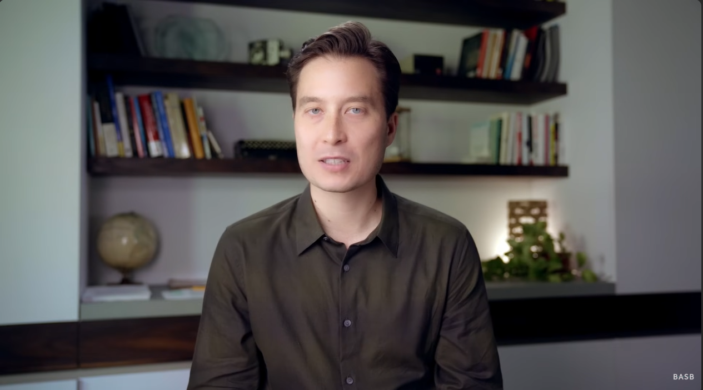

# Obsidian + PARA method - The way of making a meaningful note taking system.

##### Date : November 16, 2024 | [#Productivity]()

I was awful at managing notes of my own. Even when I wanted to look back on a specific topic in my notes, it was a hassle. My notes were unorganised and was hard to maintain. Taking notes in books is easy, but still its difficult to index when you have notes in no of books. Since most of my work I do is online nowadays, I needed a efficient note taking application which can handle all of my troubles in a single application.

## Obsidian

Obsidian is a local-first note taking application. It is fully customizable and comes with a lot of features. Graph view, canvas mode, daily notes and many more. The most popular feature obsidian offers is the graph view which helps you visualize all the notes you have created under the root folder or vault. Obsidian by default creates notes in markdown, which is nowadays defacto standard of taking and previewing notes.

> Markdown is a file type similar to JSON, XML, text files. "Markdown became popular amongst developers when Github started using it. Developers started using markdown for updating their Readme files." Developers now use it for blogging too. Now almost all the note taking applications out there now supports markdown.

## PARA

I found a youtube video by Tiago forte explaining the para method and how he uses it to take notes in evernote application. He has written a book on "The Para Method".

_TiagoForte Explaining The Para Method_

The para stands for:

1. **Projects** contains the tasks which you are curently working on
2. **Areas** groups the projects/work which focuses on same achievements or goals.
3. **Resources** needed to complete a task.
4. **Archives** it is a like a cold storage which has completed / archived work which you want to remove from the system, but still want them to index which you can look back whenver required.

There is one more process I want to add it the PARA method, which I see can complete the PARA which is the **Inbox**. The Inbox can be of great use when you dont know where to add a task / idea. You just created a new note and started writing random things
which you think can be of help to you later. This process can store your random thoughts into system and add value when working on a similar project. Once a week you can reorgainze your inbox and move the notes which you think belong to one of the PARA method.

## What you can do ?

The PARA method has and is helping me to take notes regularly and it is improving my learning by taking notes. While using Obsidian you can only store your files locally. However there is a subscription plan where you can sync your notes across devices and even publish your notes. I have a hacked process for syncing notes across devices using obsidian, let me know if you want to hear more about this.

I highly recommend giving a try to [Obsidian](https://obsidian.md/)
